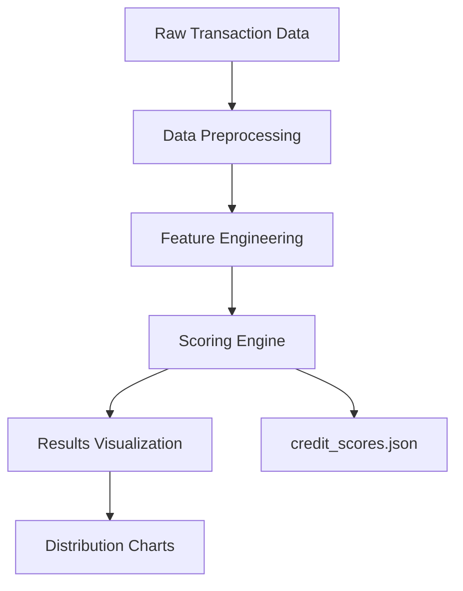

# Credit_Score_Prediction
A machine learning-based credit scoring system that evaluates wallet addresses interacting with Aave V2, generating credit scores from 0-1000 based on transaction behavior patterns.

## Features:
- **Transaction Analysis**: Processes deposit, borrow, repay, redeem, and liquidation events
- **Risk Scoring**: Generates scores from 0-1000 with clear risk categories
- **Anomaly Detection**: Identifies suspicious behavior using Isolation Forest
- **Visual Reporting**: Automatic generation of score distribution charts

## Methodology
### Score Calculation Approach
1. **Feature Engineering**:
   - Transaction frequency and recency
   - Deposit/borrow ratios
   - Repayment timeliness
   - Liquidation history
   - Temporal patterns (time of day/week)

2. **Scoring Model**:
   ```python
   base_score = (
       activity_score + 
       longevity_score + 
       repayment_score + 
       liquidation_penalty + 
       risk_penalty + 
       anomaly_penalty
   )
3. **Scores scaled to 0-1000 range using MinMaxScaler**

4. **Isolation Forest for anomaly detection**

## System Architecture/Processing Flow:


### Components:

#### 1. Data Processing:

- Extracts transaction values and timestamps

- Normalizes JSON data structure

- Calculates USD values for all transactions

#### 2. Feature Engine:
```python
features = {
    'tx_count': Transaction frequency,
    'total_value': USD volume,
    'age_days': Wallet activity duration,
    'tx_freq': tx_count/age_days+1,
    'repayment_time': Borrow-repay latency,
    'tx_ratios': Action type distribution
}
```
#### 3. Scoring Model:

- Positive Factors: Activity level, longevity, repayment speed

- Negative Factors: Liquidations, high borrowing, anomalies

- Final Score: MinMaxScaler(0-1000)

## Installation:
```bash
pip install pandas numpy matplotlib scikit-learn
```
## Run the python code:
```bash
python credit_score_predict.py
```

## Output:
- credit_score.json: contains the credit score for each id
-  
